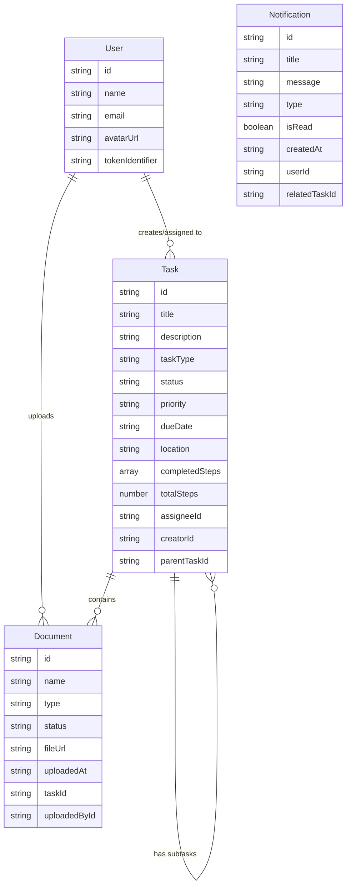

# Hospital Dashboard: Implementation Guide

This document provides a structured approach for implementing the hospital dashboard application with Convex database integration.

## Project Overview

*   **Framework:** Next.js application with TypeScript and App Router
*   **UI Components:** Shadcn/ui within `components/ui/`
*   **Styling:** Tailwind CSS 
*   **Backend:** Convex for database, authentication, and file storage
*   **Current Features:** Task management, document tracking, calendar views

## Implementation Roadmap

### Phase 1: Setup Convex Database

1. **Install Convex SDK**

```bash
npm install convex
npx convex init
```

This will create a `convex` directory with the necessary files and a `.env.local` file with your Convex deployment URL.

2. **Configure Environment Variables**

Edit or create the `.env.local` file:

```
NEXT_PUBLIC_CONVEX_URL=your_convex_deployment_url
```

3. **Create Convex Schema**

```typescript
import { defineSchema, defineTable } from "convex/server";
import { v } from "convex/values";

export default defineSchema({
  users: defineTable({
    name: v.string(),
    email: v.string(),
    avatarUrl: v.optional(v.string()),
    createdAt: v.string(),
    tokenIdentifier: v.string(),
  }).index("by_token", ["tokenIdentifier"]),
  
  tasks: defineTable({
    title: v.string(),
    description: v.optional(v.string()),
    taskType: v.string(), // e.g., 'work-permit', 'license-renewal'
    status: v.string(), // 'pending', 'in-progress', 'completed', 'overdue'
    priority: v.string(), // 'low', 'medium', 'high'
    dueDate: v.string(), // ISO date string
    location: v.optional(v.string()),
    completedSteps: v.array(v.string()), // Array of step IDs that are completed
    totalSteps: v.number(),
    
    // Relations (stored as IDs)
    assigneeId: v.string(),
    creatorId: v.string(),
    parentTaskId: v.optional(v.string()),
  })
  .index("by_assignee", ["assigneeId"])
  .index("by_status", ["status"])
  .index("by_creator", ["creatorId"])
  .index("by_parent", ["parentTaskId"]),
  
  documents: defineTable({
    name: v.string(),
    type: v.string(), // e.g., 'passport', 'certificate'
    status: v.string(), // 'required', 'uploaded', 'verified'
    fileUrl: v.optional(v.string()),
    uploadedAt: v.optional(v.string()), // ISO date string
    
    // Relations
    taskId: v.string(),
    uploadedById: v.optional(v.string()),
  })
  .index("by_task", ["taskId"])
  .index("by_uploader", ["uploadedById"]),
  
  notifications: defineTable({
    title: v.string(),
    message: v.string(),
    type: v.string(), // 'task', 'document', 'system'
    isRead: v.boolean(),
    createdAt: v.string(), // ISO date string
    userId: v.string(),
    relatedTaskId: v.optional(v.string()),
  })
  .index("by_user", ["userId"])
  .index("by_user_and_read", ["userId", "isRead"])
});
```

4. **Set Up Convex Client Provider**

Create a provider component to wrap your application with Convex:

```typescript
"use client";

import { ConvexProvider, ConvexReactClient } from "convex/react";
import { ReactNode } from "react";

const convex = new ConvexReactClient(process.env.NEXT_PUBLIC_CONVEX_URL!);

export function ConvexClientProvider({ children }: { children: ReactNode }) {
  return <ConvexProvider client={convex}>{children}</ConvexProvider>;
}
```

5. **Add the Provider to Your Layout**

```typescript
import { ConvexClientProvider } from "./providers";

export default function RootLayout({
  children,
}: {
  children: React.ReactNode;
}) {
  return (
    <html lang="en">
      <body>
        <ConvexClientProvider>{children}</ConvexClientProvider>
      </body>
    </html>
  );
}
```

### Phase 2: Create Convex Functions (Backend API)

1. **Create Task Functions**

```typescript
import { mutation, query } from "./_generated/server";
import { v } from "convex/values";

// Get all tasks with optional filtering
export const getTasks = query({
  args: {
    status: v.optional(v.string()),
    assigneeId: v.optional(v.string()),
    taskType: v.optional(v.string()),
  },
  handler: async (ctx, args) => {
    let tasks;
    if (args.status) {
      tasks = await ctx.db
        .query("tasks")
        .withIndex("by_status", (q) => q.eq("status", args.status))
        .collect();
    } else if (args.assigneeId) {
      tasks = await ctx.db
        .query("tasks")
        .withIndex("by_assignee", (q) => q.eq("assigneeId", args.assigneeId))
        .collect();
    } else {
      tasks = await ctx.db.query("tasks").collect();
    }

    // For each task, get the assignee and documents
    const tasksWithRelations = await Promise.all(
      tasks.map(async (task) => {
        const assignee = await ctx.db.get(task.assigneeId);
        const documents = await ctx.db
          .query("documents")
          .withIndex("by_task", (q) => q.eq("taskId", task._id))
          .collect();
        
        return {
          ...task,
          assignee,
          documents,
        };
      })
    );

    return tasksWithRelations;
  },
});

// Get a single task by ID
export const getTask = query({
  args: { id: v.id("tasks") },
  handler: async (ctx, args) => {
    const task = await ctx.db.get(args.id);
    if (!task) {
      return null;
    }

    const assignee = await ctx.db.get(task.assigneeId);
    const documents = await ctx.db
      .query("documents")
      .withIndex("by_task", (q) => q.eq("taskId", task._id))
      .collect();
    
    return {
      ...task,
      assignee,
      documents,
    };
  },
});

// Create a new task
export const createTask = mutation({
  args: {
    title: v.string(),
    description: v.optional(v.string()),
    taskType: v.string(),
    status: v.string(),
    priority: v.string(),
    dueDate: v.string(),
    location: v.optional(v.string()),
    completedSteps: v.array(v.string()),
    totalSteps: v.number(),
    assigneeId: v.string(),
    creatorId: v.string(),
    parentTaskId: v.optional(v.string()),
  },
  handler: async (ctx, args) => {
    const taskId = await ctx.db.insert("tasks", {
      ...args,
    });
    
    return taskId;
  },
});

// Update an existing task
export const updateTask = mutation({
  args: {
    id: v.id("tasks"),
    title: v.optional(v.string()),
    description: v.optional(v.string()),
    taskType: v.optional(v.string()),
    status: v.optional(v.string()),
    priority: v.optional(v.string()),
    dueDate: v.optional(v.string()),
    location: v.optional(v.string()),
    completedSteps: v.optional(v.array(v.string())),
    totalSteps: v.optional(v.number()),
    assigneeId: v.optional(v.string()),
  },
  handler: async (ctx, args) => {
    const { id, ...fields } = args;
    
    const existingTask = await ctx.db.get(id);
    if (!existingTask) {
      throw new Error("Task not found");
    }
    
    await ctx.db.patch(id, fields);
    
    return await ctx.db.get(id);
  },
});

// Delete a task
export const deleteTask = mutation({
  args: { id: v.id("tasks") },
  handler: async (ctx, args) => {
    const existingTask = await ctx.db.get(args.id);
    if (!existingTask) {
      throw new Error("Task not found");
    }
    
    await ctx.db.delete(args.id);
  },
});
```

2. **Create Document Functions**

```typescript
import { mutation, query } from "./_generated/server";
import { v } from "convex/values";

export const getDocuments = query({
  args: { taskId: v.optional(v.string()) },
  handler: async (ctx, args) => {
    let documents;

    if (args.taskId) {
      documents = await ctx.db
        .query("documents")
        .withIndex("by_task", (q) => q.eq("taskId", args.taskId))
        .collect();
    } else {
      documents = await ctx.db.query("documents").collect();
    }

    // Get uploader information for each document
    const documentsWithUploaders = await Promise.all(
      documents.map(async (doc) => {
        if (doc.uploadedById) {
          const uploader = await ctx.db.get(doc.uploadedById);
          return { ...doc, uploadedBy: uploader };
        }
        return doc;
      })
    );

    return documentsWithUploaders;
  },
});

export const createDocument = mutation({
  args: {
    name: v.string(),
    type: v.string(),
    status: v.string(),
    fileUrl: v.optional(v.string()),
    taskId: v.string(),
    uploadedById: v.optional(v.string()),
  },
  handler: async (ctx, args) => {
    const documentId = await ctx.db.insert("documents", {
      ...args,
      uploadedAt: args.fileUrl ? new Date().toISOString() : undefined,
    });
    
    return documentId;
  },
});

export const updateDocument = mutation({
  args: {
    id: v.id("documents"),
    status: v.optional(v.string()),
    fileUrl: v.optional(v.string()),
    uploadedById: v.optional(v.string()),
  },
  handler: async (ctx, args) => {
    const { id, ...fields } = args;
    
    // If we're updating with a file URL, add upload timestamp
    if (fields.fileUrl) {
      fields.uploadedAt = new Date().toISOString();
    }
    
    await ctx.db.patch(id, fields);
    
    return await ctx.db.get(id);
  },
});
```

### Phase 3: Add Authentication with Clerk

1. **Install Clerk packages**

```bash
npm install @clerk/nextjs @clerk/clerk-react
```

2. **Configure Environment Variables**

Add Clerk API keys to your `.env.local` file:

```
NEXT_PUBLIC_CLERK_PUBLISHABLE_KEY=your_publishable_key
CLERK_SECRET_KEY=your_secret_key
```

3. **Setup Clerk Provider**

```typescript
"use client";

import { ClerkProvider } from "@clerk/nextjs";
import { ConvexProviderWithClerk } from "convex/react-clerk";
import { ConvexReactClient } from "convex/react";
import { ReactNode } from "react";

const convex = new ConvexReactClient(process.env.NEXT_PUBLIC_CONVEX_URL!);

export function Providers({ children }: { children: ReactNode }) {
  return (
    <ClerkProvider
      publishableKey={process.env.NEXT_PUBLIC_CLERK_PUBLISHABLE_KEY}
    >
      <ConvexProviderWithClerk client={convex}>
        {children}
      </ConvexProviderWithClerk>
    </ClerkProvider>
  );
}
```

4. **Update Your Layout**

```typescript
import { Providers } from "./providers";

export default function RootLayout({
  children,
}: {
  children: React.ReactNode;
}) {
  return (
    <html lang="en">
      <body>
        <Providers>{children}</Providers>
      </body>
    </html>
  );
}
```

5. **Configure Convex Auth**

```typescript
export default {
  providers: [
    {
      domain: "https://clerk.your-domain.com",
      applicationID: "convex",
    },
  ],
};
```

### Phase 4: Using Convex in UI Components

1. **Creating a Task Card Component with Convex Data**

```typescript
"use client";

import { useQuery, useMutation } from "convex/react";
import { api } from "@/convex/_generated/api";
import { TaskCard } from "@/components/tasks/task-card";
import { useState } from "react";
import { Button } from "@/components/ui/button";
import { useRouter } from "next/navigation";

export function TaskList() {
  const tasks = useQuery(api.tasks.getTasks);
  const updateTask = useMutation(api.tasks.updateTask);
  const router = useRouter();
  const [filter, setFilter] = useState("all");

  if (tasks === undefined) return <div>Loading tasks...</div>;

  const filteredTasks = filter === "all"
    ? tasks
    : tasks.filter(task => task.status === filter);

  const handleStatusChange = async (id: string, status: string) => {
    try {
      await updateTask({ id, status });
    } catch (err) {
      console.error("Failed to update task status:", err);
    }
  };

  const handleViewDetails = (id: string) => {
    router.push(`/tasks/${id}`);
  };

  const handleEdit = (id: string) => {
    router.push(`/tasks/${id}/edit`);
  };

  // Transform Convex data to fit TaskCard component props
  const transformedTasks = filteredTasks.map(task => ({
    id: task._id,
    title: task.title,
    description: task.description,
    dueDate: new Date(task.dueDate),
    status: task.status,
    assignee: {
      id: task.assignee._id,
      name: task.assignee.name,
      avatarUrl: task.assignee.avatarUrl
    },
    location: task.location,
    documentCount: task.documents.length,
    completedDocuments: task.documents.filter(doc => 
      doc.status === "uploaded" || doc.status === "verified"
    ).length
  }));

  return (
    <div className="space-y-6">
      <div className="flex gap-2 mb-4">
        <Button 
          variant={filter === "all" ? "default" : "outline"} 
          onClick={() => setFilter("all")}
        >
          All
        </Button>
        <Button 
          variant={filter === "pending" ? "default" : "outline"} 
          onClick={() => setFilter("pending")}
        >
          Pending
        </Button>
        <Button 
          variant={filter === "in-progress" ? "default" : "outline"} 
          onClick={() => setFilter("in-progress")}
        >
          In Progress
        </Button>
        <Button 
          variant={filter === "completed" ? "default" : "outline"} 
          onClick={() => setFilter("completed")}
        >
          Completed
        </Button>
      </div>

      <div className="grid grid-cols-1 md:grid-cols-2 lg:grid-cols-3 gap-4">
        {transformedTasks.map((task) => (
          <TaskCard
            key={task.id}
            id={task.id}
            title={task.title}
            description={task.description}
            dueDate={task.dueDate}
            status={task.status}
            assignee={task.assignee}
            location={task.location}
            documentCount={task.documentCount}
            completedDocuments={task.completedDocuments}
            onStatusChange={handleStatusChange}
            onEdit={handleEdit}
            onViewDetails={handleViewDetails}
          />
        ))}
        
        {transformedTasks.length === 0 && (
          <div className="col-span-full text-center py-8">
            <p className="text-gray-500">No tasks found.</p>
          </div>
        )}
      </div>
    </div>
  );
}
```

2. **Implementing Document Upload with Convex Storage**

```typescript
"use client";

import { useState } from "react";
import { useQuery, useMutation, useConvexAuth } from "convex/react";
import { api } from "@/convex/_generated/api";
import { Button } from "@/components/ui/button";
import { Input } from "@/components/ui/input";
import { Progress } from "@/components/ui/progress";
import { useToast } from "@/components/ui/use-toast";
import { useAuth } from "@clerk/clerk-react";

interface DocumentUploaderProps {
  taskId: string;
  documentType: string;
  maxSize?: number; // in MB
  allowedTypes?: string[]; // e.g., ['pdf', 'jpg']
  onUploadComplete: (fileUrl: string) => void;
}

export function DocumentUploader({
  taskId,
  documentType,
  maxSize = 5,
  allowedTypes = ["pdf", "jpg", "jpeg", "png"],
  onUploadComplete
}: DocumentUploaderProps) {
  const [file, setFile] = useState<File | null>(null);
  const [progress, setProgress] = useState(0);
  const [uploading, setUploading] = useState(false);
  const { toast } = useToast();
  const { userId } = useAuth();
  const createDocument = useMutation(api.documents.createDocument);
  const generateUploadUrl = useMutation(api.files.generateUploadUrl);

  const handleFileChange = (e: React.ChangeEvent<HTMLInputElement>) => {
    if (!e.target.files || e.target.files.length === 0) {
      setFile(null);
      return;
    }

    const selectedFile = e.target.files[0];
    
    // Check file size
    if (selectedFile.size > maxSize * 1024 * 1024) {
      toast({
        title: "File too large",
        description: `File must be smaller than ${maxSize}MB`,
        variant: "destructive"
      });
      return;
    }
    
    // Check file type
    const fileExt = selectedFile.name.split(".").pop()?.toLowerCase() || "";
    if (!allowedTypes.includes(fileExt)) {
      toast({
        title: "Unsupported file type",
        description: `Only ${allowedTypes.join(", ")} files are allowed`,
        variant: "destructive"
      });
      return;
    }
    
    setFile(selectedFile);
  };

  const uploadFile = async () => {
    if (!file || !userId) return;
    
    setUploading(true);
    setProgress(10);
    
    try {
      // Get a pre-signed URL from Convex
      const uploadUrl = await generateUploadUrl();
      
      // Upload the file to Convex Storage
      const result = await fetch(uploadUrl, {
        method: "POST",
        headers: { "Content-Type": file.type },
        body: file,
      });
      
      if (!result.ok) {
        throw new Error("Failed to upload file");
      }
      
      setProgress(50);
      
      const { storageId } = await result.json();
      
      // Create a document record in the database
      const documentId = await createDocument({
        name: file.name,
        type: documentType,
        status: "uploaded",
        fileUrl: storageId, // Store the Convex storage ID
        taskId,
        uploadedById: userId,
      });
      
      setProgress(100);
      
      toast({
        title: "Upload complete",
        description: "File has been successfully uploaded",
      });
      
      onUploadComplete(storageId);
    } catch (error) {
      toast({
        title: "Upload failed",
        description: error instanceof Error ? error.message : "An unknown error occurred",
        variant: "destructive"
      });
    } finally {
      setUploading(false);
      setFile(null);
    }
  };

  return (
    <div className="space-y-4">
      <Input 
        type="file" 
        onChange={handleFileChange}
        disabled={uploading}
        accept={allowedTypes.map(type => `.${type}`).join(",")}
      />
      
      {file && (
        <div className="space-y-2">
          <p className="text-sm text-gray-500">
            Selected file: {file.name} ({(file.size / 1024 / 1024).toFixed(2)}MB)
          </p>
          
          {uploading && (
            <Progress value={progress} className="h-2 w-full" />
          )}
          
          <Button 
            onClick={uploadFile} 
            disabled={uploading}
          >
            {uploading ? "Uploading..." : "Upload File"}
          </Button>
        </div>
      )}
    </div>
  );
}
```

### Phase 5: File Storage Integration

Create file handling functions for Convex storage:

```typescript
import { mutation } from "./_generated/server";
import { v } from "convex/values";
import { StorageReader, StorageWriter } from "./_generated/server";

// Generate a URL for file uploads
export const generateUploadUrl = mutation({
  args: {},
  handler: async (ctx, args) => {
    return await ctx.storage.generateUploadUrl();
  },
});

// Get a URL to download a file
export const getDownloadUrl = mutation({
  args: { storageId: v.string() },
  handler: async (ctx, args) => {
    return await ctx.storage.getUrl(args.storageId);
  },
});
```

## Development Workflow

1. **Set up Convex project**
   - Initialize Convex and set up schema
   - Create Convex functions for tasks, documents, and file storage

2. **Implement authentication with Clerk**
   - Configure Clerk provider
   - Set up authentication hooks

3. **Connect UI components to Convex**
   - Replace direct API calls with Convex queries and mutations
   - Update components to handle Convex data format

4. **Implement file storage with Convex**
   - Create file upload/download functions
   - Update document uploader component

5. **Test and deploy**
   - Test application locally
   - Deploy to Convex cloud

## Benefits of Using Convex

1. **Real-time data synchronization**: Convex automatically handles real-time updates, so your UI always displays the latest data without manual refresh.

2. **Built-in authentication**: Seamless integration with authentication providers like Clerk.

3. **Serverless functions**: Write backend logic directly in Convex functions without maintaining separate API routes.

4. **File storage**: Built-in storage system for document uploads.

5. **Simplified development**: Less boilerplate code compared to traditional database/API approaches.

## Database Schema Reference

